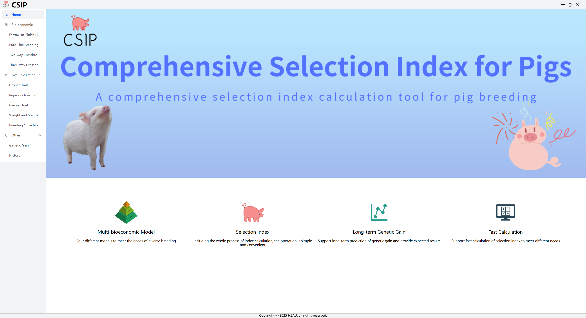

# User Documentation

[//]: # (## 🚀 Quick Start)

Welcome to our software! This guide will help you get started quickly.

::: tip Before You Begin
Make sure your system meets the [minimum requirements](/download#system-requirements) before proceeding with installation.
:::

## 📦 Installation

### Windows Installation

1. **Download the installer** from our [download page](/download)
2. **Run the installer** by double-clicking the `.exe` file
3. **Follow the setup wizard**:
   - Choose installation directory
   - Install
   - Create desktop shortcut
4. **Complete installation** and launch the application

[//]: # (### macOS Installation)

[//]: # ()
[//]: # (1. **Download the `.dmg` file** from our [download page]&#40;/download&#41;)

[//]: # (2. **Open the DMG file** by double-clicking)

[//]: # (3. **Drag the application** to the Applications folder)

[//]: # (4. **Launch the app** from Applications)

## 💡 Basic Usage

[//]: # (### Main Interface Overview)

#### Menu Bar
- **Home**: main page
- **Bio-economic Model**: Farrow-to-Finish Herd, Pure-Line Breeding System, Two-way Crossbreeding System, Three-way Crossbreeding System
- **Fast Calculation**: Growth Trait, Reproductive Trait, Carcass Trait, Weight and Standardization of Trait, Breeding Objective
- **Other**: Genetic Gain, History

  

#### The usage process of the Bio-economic Model Module, taking "Farrow-to-Finish Herd" as an example:
1. Select the desired traits.
2. Input growth performance parameters, or keep default parameters. 
3. Input management parameters or keep default parameters. 
4. Input market economy  parameters, or keep default parameters. 
5. Calculate the economic weights of traits. 
6. Results of economic weights and sensitivity analysis of traits. 
7. Input genetic parameters. 
8. Calculate selection index results. 
9. Results of selection index results: Displaying the relative economic weights of traits and the selection index. 
10. Results of simulate population genetic response: Present the line graph showing the expected genetic gain of the selected traits.

#### Fast Calculation Module

- **Growth Traits**: 
Select the desired trait, input parameters and click calculate to get results.

- **Reproductive Traits**: 
Select the desired trait, input parameters and click calculate to get results.

- **Carcass Traits**: 
Select the desired trait, input parameters and click calculate to get results.

- **Weight and Standardization of Trait**: 
Input trait economic values to calculate comprehensive selection index.

- **Breeding Objective**: 
Input expected objectives and required parameters to calculate results.

#### Other Function

- **Genetic Gain**: 
Input comprehensive selection index and genetic parameters to quickly calculate genetic response.

- **History**: 
Display bio-economic model historical records.

## 🔧 Troubleshooting

[//]: # (### Common Issues)

#### Application Won't Start
1. **Check system requirements** - Ensure compatibility
2. **Restart your computer** - Clear memory issues
3. **Run as administrator** - Resolve permission problems
4. **Reinstall software** - Fix corrupted installation

---

::: tip Need More Help?
This documentation covers the most common use cases. For specific questions or advanced topics, please contact us.
:::

